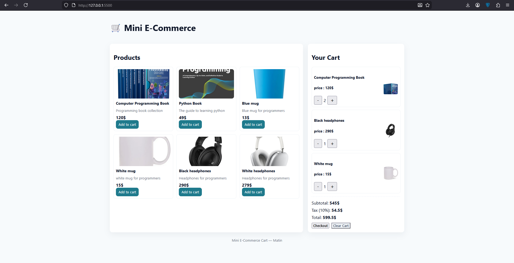

# TypeScript E-Commerce Cart Application

A TypeScript-powered shopping cart application that allows users to browse products, add them to the cart, update quantities, and proceed through a checkout flow. The project demonstrates strong understanding of TypeScript features and best practices for writing maintainable and scalable code.

---

## ✨ Features
- Browse a list of products with details and images
- Add, remove, and update product quantities in the cart
- Calculate total price dynamically
- Persist cart data using LocalStorage
- Responsive and modern UI design
- TypeScript interfaces, types, and strict type checking for all objects
  
---

## 🛠️ Tech Stack
- TypeScript
- HTML5
- CSS3
- LocalStorage

---

## 🚀 How to Run
1. Clone the repository
2. Compile TypeScript to JavaScript using `tsc` (or open the precompiled JS)
3. Open `index.html` in your browser
4. Interact with the cart and test all functionalities

---

## 🎯 Purpose of This Project
This project highlights the ability to:
- Build a fully interactive, real-world front-end application using TypeScript
- Utilize TypeScript types, interfaces, and strict checking to prevent runtime errors
- Implement dynamic UI updates based on user interaction
- Apply modern front-end best practices for maintainable and scalable code

---

## 📩 Feedback
If you have any suggestions, improvements, or feedback, feel free to open an issue or submit a pull request.
